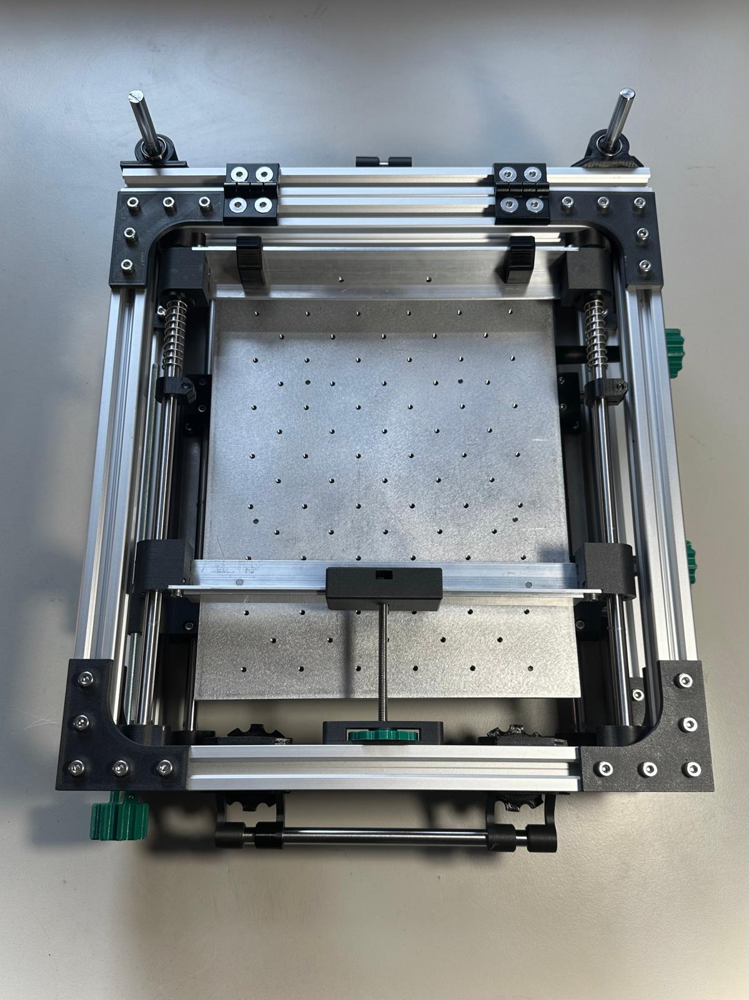
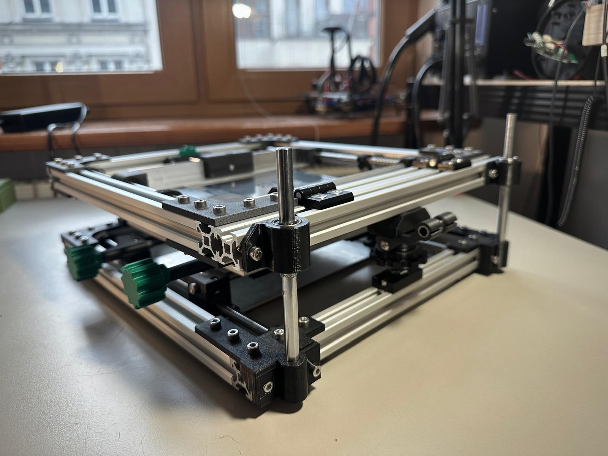

# 4 Axis PCB Stencil Printer w/ Rotational Axis

This is a GitHub mirror/fork of the 4 Axis PCB Stencil Printer
with Rotational Axis by Philipp of [Dengler Mechatronik GmbH](https://dengler-mechatronik.de/).

You can find the source material on:
* [Thingiverse](https://www.thingiverse.com/thing:5690704)
* [Initial announcement](https://dengler-mechatronik.de/?p=560)
* [Digital build log](https://dengler-mechatronik.de/?p=790)

I chose to build this project because of its large working field,
and focus on what really matters - accurate stencil alignment.

All the modifications and their status is described below.

## Mods

### Top plate workholding
This mod adds workholding features (tapped holes) to the top plate,
making adding tooling a breaze.

Technical drawing: [`technical-drawings/top-plate-workholding.dxf`](`top-plate-workholding.dxf`)

Status: in use

### Linear Z axis
Caveat emptor: I never did manage to get the back of the eccenter Z axis working to my satisfaction.
The clamp either captured the threaded rod fully or not at all, not allowing for movement, or rendering
it in raspy freefall over the threads. It is possible I just didn't get it.

What I did manage to get working, however, is a Dremel against a left-over linear rod from a 3D printer,
and hence, the linear Z axis mod was born. It does away with the 2 x 140 mm long M8 threaded rods, and
replaces them with 2 x 140 mm long 8 mm linear rods riding on a bearing mounted to the top frame.
The eccenter mechanism is replaced with the same eccenter used on the front. In order to do that, the 2040
300 mm extrusion is swapped with a 2020 size extrusion of the same length.

Status: in use

### Hinge locks
The hinges I used still allowed for some play between the back of the frame and the moving part.
Hence the hinge locks were born: if you're looking for repeatability across multiple applies,
or just to increase overall rigidity of the top frame when closed, this is the drop-in addon to print. 

Status: in use

## Structure

* [`technical-drawings/`](technical-drawings/) - technical drawings in DXF and PDF formats for CNC manufacturing
* [`cad/`](cad/) - source CAD files, either original author's (STLs), or mine (FreeCAD, CadQuery)
* [`docs/`](docs/) - documentation
